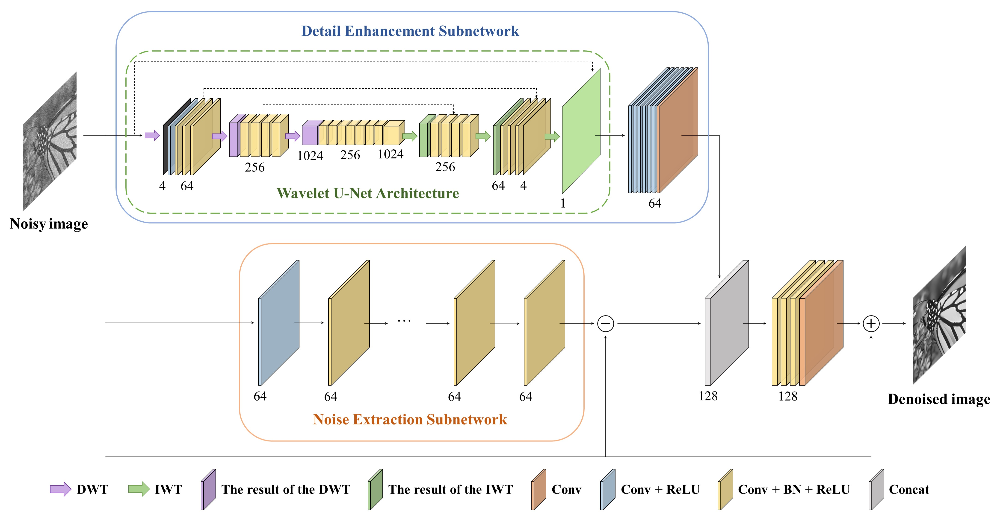

# WDENet: Wavelet-based Detail Enhanced Image Denoising Network

#### News

- **Jun 23, 2021**: Outstanding Student Paper at Summer Conference of The Korean Institute of Broadcast and Media Engineers
- **Nov 30, 2021**: Paper accepted at Journal of Broadcast Engineering

> **Abstract:** 
> *Although the performance of cameras is gradualy improving now, there are noise in the acquired digital images from the camera, 
> which acts as an obstacle to obtaining high-resolution images. Traditonaly, a filtering method has ben used for denoising, 
> and a convolutional neural network (CNN), one of the dep learning techniques, has ben showing beter performance than traditonal 
> methods in the field of image denoising, but the details in images could be lost during the learning proces. In this paper, 
> we present a CNN for image denoising, which improves image details by learning the details of the image based on wavelet transform. 
> The proposed network uses two subnetworks for detail enhancement and noise extraction. The experiment was conducted through 
> Gausian noise and real-world noise, we confirmed that our proposed method was able to solve the detail los problem more 
> efectively than conventional algorithms, and we verifed that both objective quality evaluation and subjective quality comparison showed excelent results.*

The paper can be found [here](https://drive.google.com/file/d/10HraJJhfs9BG2fBidJmaPZR5iCRtTAZ7/view?usp=share_link).

## Network Architecture

## Training and Evaluation

The used training and testing datasets and visual results can be downloaded as follows:

<table>
  <tr>
    <th align="center">Task</th>
    <th align="center">Training Datasets</th>
    <th align="center">Testing Datasets</th>
    <th align="center">WDENet's Pre-trained Models</th>
    <th align="center">WDENet's Visual Results</th>
  </tr>
  <tr>
    <td align="center">Gaussian Grayscale Image Denoising</td>
    <td align="center">DIV2K</td>
    <td align="center">Set12, BSD68</td>
    <td align="center"><a href="https://drive.google.com/drive/folders/1LpIvOZVWYnJFrbSozbduILSYzFgtzl27?usp=share_link">Download</a></td>
    <td align="center"><a href="https://drive.google.com/drive/folders/18odkQwbHcnP2zRwZsrmHh7pjVHUjJXEI?usp=share_link">Here</a></td>
  </tr>
  <tr>
    <td align="center">Real Image Denoising</td>
    <td align="center">SIDD-Medium Dataset</td>
    <td align="center">SIDD Validation Dataset</td>
    <td align="center"><a href="https://drive.google.com/drive/folders/1bCZVaUpDgA3m2uqiCpMm2F8e1ie2EuDn?usp=share_link">Download</a></td>
    <td align="center"><a href="https://drive.google.com/drive/folders/1j4T_rWC-QLiNIq5zNnR9bk29Knr0GKOs?usp=share_link">Here</a></td>
  </tr>
</table>

## Instructions

<table>
  <tr>
    <th align="center">Task</th>
    <th align="center">Training Instructions</th>
    <th align="center">Testing Instructions</th>
  </tr>
  <tr>
    <td align="center">Gaussian Grayscale Image Denoising</td>
    <td align="center"><a href="Gaussian_Grayscale_Denoising/README.md#training">Link</a></td>
    <td align="center"><a href="Gaussian_Grayscale_Denoising/README.md#evaluation">Link</a></td>
  </tr>
  <tr>
    <td align="center">Real Image Denoising</td>
    <td align="center"><a href="Real_Image_Denoising/README.md#training">Link</a></td>
    <td align="center"><a href="Real_Image_Denoising/README.md#evaluation">Link</a></td>
  </tr>
</table>

## Results

Experiments are performed for different image restoration tasks including, gaussian grayscale denoising and real image denoising.

### PSNR and SSIM scores

<strong>Gaussian Grayscale Image Denoising</strong>

 

<strong>Real Image Denoisng</strong>

 

### Visual results

<strong>Gaussian Grayscale Image Denoising</strong>

 

- Gaussian color image denoising results of Urban100 with noise level 50.

<strong>Real Image Denoisng</strong>

 

- Real image denoising results of SIDD validation dataset.

### Run Time
- Run time (in seconds) of different methods on grayscale images of size 256 × 256 , 512 × 512 and 1024 × 1024 with noise level 25.

Pre-trained models of WDENet can be downloaded [here](#training-and-evaluation).

## Contact
Should you have any question, please contact gooni0906@gmail.com.
